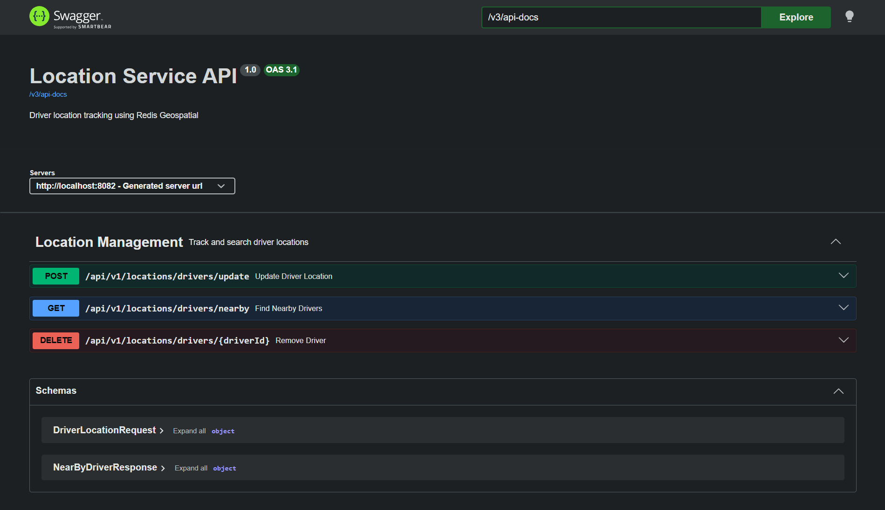
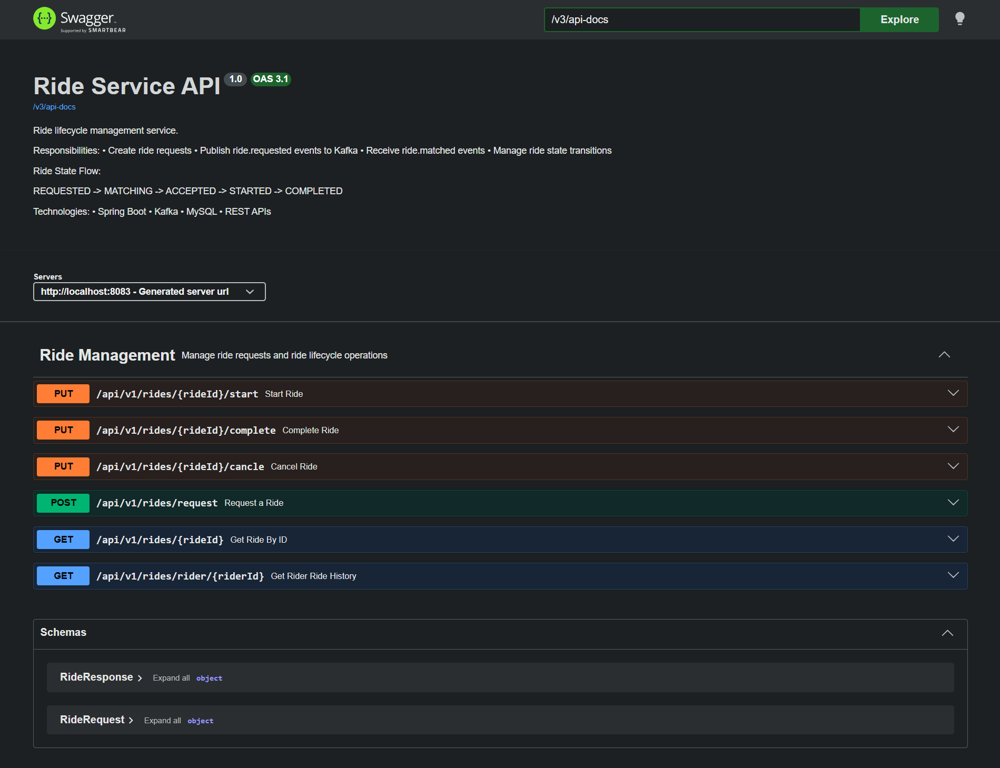

# 🚗 Uber Ride Matching System

A **microservices-based ride matching backend** built with Spring Boot, Redis, Kafka, and MySQL — simulating how Uber matches riders with the nearest available driver in real time.

---

## 📦 Project Structure

```text
Uber-Ride-Matching-System/
├── location-service/     → Tracks driver locations (Redis)
├── ride-service/         → Manages ride lifecycle (MySQL + Kafka)
├── matching-service/     → Matches drivers to ride requests (Kafka)
└── docker-compose.yml    → Spins up Redis, MySQL, Kafka, Zookeeper
```

---

## 🛠️ Tech Stack

| Technology       | Role                                   |
| ---------------- | -------------------------------------- |
| Spring Boot      | Microservices framework                |
| Redis Geospatial | Real-time driver location storage      |
| Apache Kafka     | Async event streaming between services |
| MySQL            | Persistent ride data storage           |
| Docker Compose   | Local infrastructure setup             |
| Swagger/OpenAPI  | API documentation                      |

---

## 🧩 Services Overview

| Service            | Port   | Responsibility                                          |
| ------------------ | ------ | ------------------------------------------------------- |
| `location-service` | `8082` | Stores & queries driver GPS coordinates via Redis       |
| `ride-service`     | `8083` | Creates rides, manages state, produces/consumes events  |
| `matching-service` | `8084` | Listens for ride requests, scores & assigns best driver |

---

## 🔄 Architecture Flow

```text
Driver Phone  →  Location Service  →  Redis (GEOADD)
                                         ↑ stores GPS coords

Rider App  →  Ride Service  →  Kafka Topic: ride.requested
                                      ↓
                          Matching Service (Kafka Consumer)
                                      ↓
                          Location Service (find nearby drivers)
                          [Redis GEORADIUS query within 5km]
                                      ↓
                          Driver Scoring Algorithm
                                      ↓
                          Kafka Topic: ride.matched
                                      ↓
                          Ride Service (updates ride → ACCEPTED)
```

---

## 🔢 Ride State Machine

A ride goes through these states from creation to completion:

```text
REQUESTED → MATCHING → ACCEPTED → STARTED → COMPLETED
```

| State       | Trigger                            |
| ----------- | ---------------------------------- |
| `REQUESTED` | Rider submits ride request         |
| `MATCHING`  | Ride service publishes Kafka event |
| `ACCEPTED`  | Matching service assigns driver    |
| `STARTED`   | Driver starts ride                 |
| `COMPLETED` | Driver completes ride              |

---

## 🧠 Driver Scoring Algorithm

When multiple drivers are nearby, the best driver is selected using a weighted score:

```text
score = (1 / (1 + distanceKm)) × 0.85
      + (rating / 5.0) × 0.15
```

* 85% weight → Distance
* 15% weight → Driver rating

The driver with the highest score is assigned the ride.

---

## 📖 API Documentation

After starting the services:

| Service          | Swagger URL                                 |
| ---------------- | ------------------------------------------- |
| Location Service | http://localhost:8082/swagger-ui/index.html |
| Ride Service     | http://localhost:8083/swagger-ui/index.html |

Swagger provides:

* Endpoint documentation
* Request/Response schemas
* Example payloads
* Interactive API testing

---

## 📸 Screenshots

### Location Service Swagger

Add screenshot here:

```markdown

```

### Ride Service Swagger

Add screenshot here:

```markdown

```

Recommended repository structure:

```text
screenshots/
├── location-swagger.png
└── ride-swagger.png
```

---

## 🚀 How To Run

### Prerequisites

* Java 17+
* Maven
* Docker
* Docker Compose

---

### Step 1 — Start Infrastructure

```bash
docker-compose up -d
```

This starts:

* Redis
* MySQL
* Kafka
* Zookeeper

Wait approximately 30 seconds for Kafka to initialize.

---

### Step 2 — Start Location Service

```bash
cd location-service
mvn spring-boot:run
```

Runs on:

```text
http://localhost:8082
```

---

### Step 3 — Start Ride Service

```bash
cd ride-service
mvn spring-boot:run
```

Runs on:

```text
http://localhost:8083
```

---

### Step 4 — Start Matching Service

```bash
cd matching-service
mvn spring-boot:run
```

Runs on:

```text
http://localhost:8084
```

---

## 🧪 End-to-End Testing

### Step 1 — Register Driver Locations

```http
POST http://localhost:8082/api/v1/locations/drivers/update
Content-Type: application/json

{
  "driverId": "driver:1",
  "latitude": 12.9716,
  "longitude": 77.5946
}
```

Repeat with multiple drivers to simulate nearby availability.

---

### Step 2 — Request a Ride

```http
POST http://localhost:8083/api/v1/rides/request
Content-Type: application/json

{
  "riderId": "rider:1",
  "pickupLatitude": 12.9716,
  "pickupLongitude": 77.5946,
  "pickupAddress": "MG Road, Bangalore",
  "dropLatitude": 12.9352,
  "dropLongitude": 77.6245,
  "dropAddress": "Koramangala, Bangalore"
}
```

Flow:

```text
Ride Service
      ↓
ride.requested
      ↓
Matching Service
      ↓
Find Nearby Drivers
      ↓
Select Best Driver
      ↓
ride.matched
      ↓
Ride Service Updates Ride
```

---

### Step 3 — Check Ride Status

```http
GET http://localhost:8083/api/v1/rides/{rideId}
```

Expected:

```text
status = ACCEPTED
driverId assigned
```

---

### Step 4 — Start Ride

```http
PUT http://localhost:8083/api/v1/rides/{rideId}/start
```

---

### Step 5 — Complete Ride

```http
PUT http://localhost:8083/api/v1/rides/{rideId}/complete
```

---

### Step 6 — Rider History

```http
GET http://localhost:8083/api/v1/rides/rider/rider:1
```

---

## 🔍 Verify in Redis CLI

```bash
docker exec -it redis-geo redis-cli
```

List drivers:

```bash
ZRANGE drivers:location 0 -1
```

Driver position:

```bash
GEOPOS drivers:location "driver:1"
```

Distance between drivers:

```bash
GEODIST drivers:location "driver:1" "driver:2" km
```

---

## 🌐 Kafka Topics

| Topic            | Producer         | Consumer         | Purpose                  |
| ---------------- | ---------------- | ---------------- | ------------------------ |
| `ride.requested` | Ride Service     | Matching Service | Notify new ride request  |
| `ride.matched`   | Matching Service | Ride Service     | Notify driver assignment |

---

## 🔐 Environment Variables

### Location Service

```env
REDIS_HOST=localhost
REDIS_PORT=6379
```

### Ride Service

```env
DB_URL=jdbc:mysql://localhost:3306/uberapp
DB_USERNAME=root
DB_PASSWORD=your_password

KAFKA_BOOTSTRAP_SERVERS=localhost:9092
```

### Matching Service

```env
KAFKA_BOOTSTRAP_SERVERS=localhost:9092
LOCATION_SERVICE_URL=http://localhost:8082
```

---

## 🎯 Backend Engineering Concepts Demonstrated

* Microservices Architecture
* Event-Driven Communication
* Asynchronous Processing
* Redis Geospatial Queries
* Service-to-Service Communication
* Kafka Producers & Consumers
* Domain Modeling
* Ride State Machine Design
* Driver Matching Algorithms
* Infrastructure Orchestration with Docker Compose
* REST API Design
* API Documentation with Swagger/OpenAPI

---

## 📚 Key Concepts Covered

| Concept                  | Where Used                  |
| ------------------------ | --------------------------- |
| Redis Geospatial         | Location Service            |
| Kafka Producer           | Ride Service                |
| Kafka Consumer           | Matching Service            |
| Kafka Event Streaming    | Inter-service communication |
| Feign Client             | Matching → Location Service |
| Ride State Machine       | Ride Service                |
| Driver Scoring Algorithm | Matching Service            |
| Docker Compose           | Infrastructure setup        |
| Swagger/OpenAPI          | API Documentation           |

---

## ⚙️ Infrastructure Ports

| Service          | Port   |
| ---------------- | ------ |
| Redis            | `6379` |
| MySQL            | `3306` |
| Zookeeper        | `2181` |
| Kafka            | `9092` |
| Location Service | `8082` |
| Ride Service     | `8083` |
| Matching Service | `8084` |

---

## 🚧 Future Enhancements

* JWT Authentication & Authorization
* Driver Availability Management
* Real-Time Ride Tracking
* WebSocket Notifications
* API Gateway
* Service Discovery
* Distributed Tracing
* Kubernetes Deployment
* CI/CD Pipeline
* Monitoring with Prometheus & Grafana
* Driver Rating Persistence
* Surge Pricing Engine

---

## ⭐ What This Project Demonstrates

This project simulates the core backend workflow of a ride-sharing platform by combining:

* Real-time location tracking
* Geospatial driver search
* Event-driven ride matching
* Distributed service communication
* Ride lifecycle management

The architecture is inspired by real-world ride-hailing platforms and was built to explore scalable backend system design patterns using Spring Boot microservices.

---

## 👤 Author

Built by **Sandeep** to explore real-world backend engineering concepts including microservices, event-driven architecture, geospatial search, and distributed systems.
